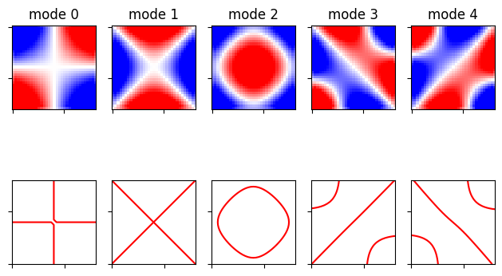
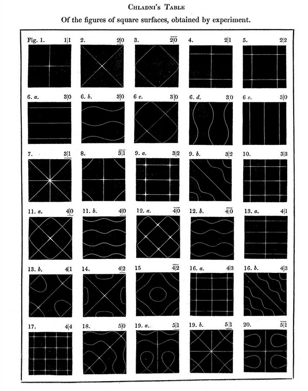

# Vibrating plates

This is the code that I used as part of my honours project where I use computational methods to determine the vibrational modes of a metal plate.

These can be compared with experimentally determined chaladni figures to show their validity. See this [article](https://web.mit.edu/redingtn/www/netadv/SP20140804.html) for source of image.

